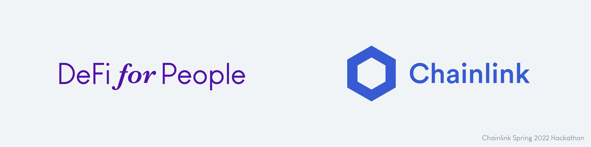

# Chainlink Hackaton

## Problem

Lorem ipsum dolor sit amet, consectetur adipiscing elit. Proin convallis ultricies nisl nec condimentum. Sed sollicitudin massa lorem, eleifend sodales magna faucibus non. In hac habitasse platea dictumst. Nulla viverra diam vel augue gravida pulvinar. In id rutrum mauris. Etiam eleifend orci lectus, nec scelerisque mauris tempus at. Fusce dictum egestas mollis. 

## Solution

Sed pharetra fringilla hendrerit. Suspendisse diam risus, lobortis sed sollicitudin nec, ultrices in nibh. Phasellus et massa ac odio iaculis accumsan. Phasellus mollis felis id purus aliquet, nec commodo mauris lacinia. Aenean eget nulla tortor. Suspendisse potenti. Phasellus commodo condimentum mi, vestibulum facilisis metus. Maecenas imperdiet nisi vel tellus porta, ut lacinia est ultricies. Pellentesque ligula diam, elementum sit amet laoreet quis, lacinia sed felis.

## Architecture

## Testing and Development

Phasellus imperdiet, eros ut porta laoreet, velit purus lobortis lorem, sed condimentum eros turpis et eros. Praesent facilisis finibus mauris ut vulputate. In nec bibendum metus. 

### Dependencies

Morbi tempus, dolor vitae vehicula lacinia, velit mi ullamcorper tortor, id molestie diam neque et arcu. Vestibulum gravida egestas metus, eget cursus elit varius eu. Cras interdum nibh ut leo dignissim scelerisque. Proin pretium nisi quis tellus molestie vestibulum.

### Setup

Aenean a pharetra tellus, nec commodo libero. Phasellus nec mattis dui. Proin tristique pretium lacus non faucibus. Nam aliquam porta felis, at tempus elit commodo ut. Suspendisse sed nisi faucibus, sollicitudin magna in, auctor felis.

### Organization and Workflow

Aliquam ullamcorper libero lectus, vitae vestibulum lectus congue quis. Donec hendrerit felis dui, id venenatis risus convallis blandit. Nulla ultricies, est eget tincidunt malesuada, turpis ante tempus enim, nec pharetra libero mauris sed eros. Vestibulum ultrices tincidunt dignissim. Proin iaculis magna at odio facilisis interdum.

### Running the Tests

Duis faucibus pulvinar est at ullamcorper. Etiam ullamcorper, quam congue vehicula blandit, enim purus tempus dui, eu porta odio mi eu enim. Nam non est lacinia arcu tincidunt faucibus. Nam rhoncus turpis nec dictum maximus. Maecenas sit amet urna nunc. Duis non leo non neque porttitor gravida ut ac dui.

## Deployment

Nunc ultricies, risus ac luctus dictum, felis est facilisis diam, sit amet cursus nunc dolor finibus ligula. Aenean vel sem ex. Sed molestie massa vitae interdum facilisis. Suspendisse venenatis, nulla id facilisis maximus, massa augue fermentum turpis, nec rhoncus lacus nunc ultrices lorem. Nulla sit amet leo massa. 

## License

Fusce consequat lobortis quam, quis semper lectus pharetra vitae. Nunc eleifend volutpat odio, sed iaculis sapien aliquet vitae. Morbi sit amet sodales arcu. Suspendisse semper nisl ac nisi feugiat pharetra. Maecenas dapibus dictum egestas. 
